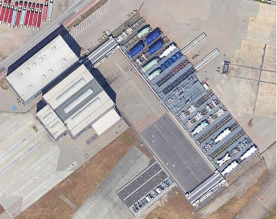
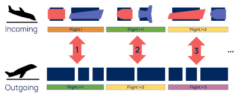

# Beluga AI Challenge

The TUPLES Consortium invites members of the Planning and Scheduling community to submit ideas for novel approaches to trustworthy planning and scheduling.

Our competition is based on a real industrial use case — associated with the complex logistics of Aircraft assembly, including managing components carried by the [Airbus Beluga XL](https://aircraft.airbus.com/en/aircraft/freighters/belugaxl) transporter.

There will be two different facets of the competition:

1. A [Scalability](scalability/README.md) Challenge — Solving planning problems of increasing size and complexity, to include two tracks:
   1. a Deterministic Track
   1. a Probabilistic Track
1. An [Explainability](explainability/README.md) Challenge — Providing explanations of plans, including why they may be infeasible, and providing suggestions for how to resolve any inconsistencies.

In this repository you will find the necessary technical information, and instructions to allow you to begin developing solutions.

The sub-modules link to additional repositories containing:

- the challenge [toolkit](https://github.com/TUPLES-Trustworthy-AI/Beluga-AI-Challenge-Toolkit)
- training [benchmark set](https://github.com/TUPLES-Trustworthy-AI/Beluga-AI-Challenge-Benchmarks) 

# Use Case Description

The competition is based on a logistic planning problem proposed by Airbus. It deals with the storage and management of cargo transported by Beluga aircrafts. Those bring aircraft parts that need to be pushed to – or pulled from – a rack system that works as a bidirectional multi queue system.

Aircraft parts are held on **jigs** (the gray structure that appears in front of the red tarpaulin in [Figure 1](#Figure1)), which can slide and be stored on the **racks**. Trailers (as the one seen in [Figure 1](#Figure1) below) are used as special moving racks to transfer the jigs between the Beluga and the fixed racks (seen in [Figure 2](#Figure2)). When the aircraft parts are sent to the production lines, they transit to hangars where cranes remove the parts from the jigs. The parts are then sent to production and the jigs return empty to the rack system.

|                                                                                     
Figure 1
                                                                                      |                                                                              
Figure 2
                                                                              |
| :------------------------------------------------------------------------------------------------------------------------------------------------------------------------------------------------------------------------------------: | :---------------------------------------------------------------------------------------------------------------------------------------------------------------------------------------------------------------------: |
|  |  |
|            <i>Unloading of an aircraft part from the Beluga; jigs (gray part in front of the red tarpaulin) hold aircraft parts and can slide on trailers (white structure on the left) and racks (see right picture) </i>             |             <i>Rack system used to store the Beluga cargo; racks are seen on the right side of the picture while the Beluga aircraft is usually parked on the left side of the hangar seen on the left.</i>             |

The racks can contain several jigs in sequence, but only the jigs which are at the edges of the racks (either factory side or Beluga side) can be pulled out from the racks. This might require swapping jigs located at the rack edges to other racks in order to free the pass to jigs which are strictly inside the racks (i.e. not at their edges).

Concerning the empty jigs to be returned to the Beluga, we only need to know their types – a jig type being a class of jigs of same loaded size and same empty size – and how many such empty jig types must be returned.

When the Beluga lands on the production site, 2 high-level tasks must be performed:

- **unloading** the parts (held on jigs) from the Beluga and **storing** them in the rack system ;
- **unstoring** empty jigs from the rack system and **loading** them into the Beluga.

Between 2 Beluga flights, 3 high-level tasks must be considered:

- **unstoring** parts held on jigs from the rack system and sending them to the production lines via the craning hangars ;
- **sending back empty jigs** from the craning hangars to the rack system;
- [optionally] **swapping the jigs** which are at the edges of the racks (either factory side or Beluga side) from one rack to another, in order to free the pass to jigs which are strictly inside the racks

Of course, those high-level tasks are decomposed in low-level actions described elsewhere in this repository, on which the controller actually applies.

|                                                                                                                        
Figure 3
                                                                                                                         |                                                                                                                                                                                                                                                                                     
Figure 4
                                                                                                                                                                                                                                                                                      |
| :----------------------------------------------------------------------------------------------------------------------------------------------------------------------------------------------------------------------------------------------------------------------------------------------------------: | :------------------------------------------------------------------------------------------------------------------------------------------------------------------------------------------------------------------------------------------------------------------------------------------------------------------------------------------------------------------------------------------------------------------------------------------------------------------------------------------------------------------------------------------------------------------------------------------------------------------------------------: |
|  |  |
|                                                                                                                               <i>Chaining of incoming and outgoing flights</i>                                                                                                                               |                                                                                                                                                                                    <i>High-level representation of the problem, depicting the incoming and outgoing flights, the pulling and pushing actions from/to the racks, the trailers and the hangars where parts are unloaded from the jigs before sending them to the production lines</i>                                                                                                                                                                                    |
