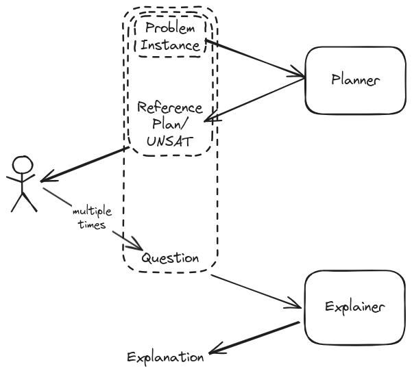
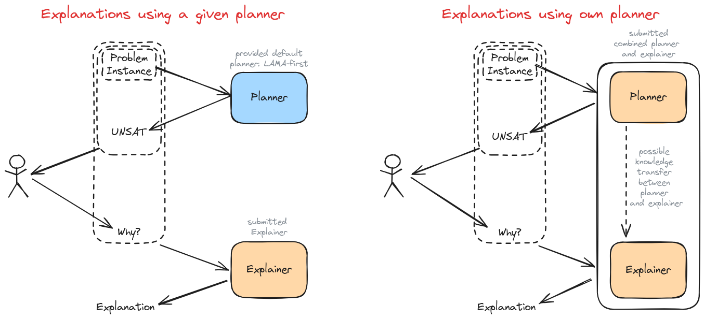
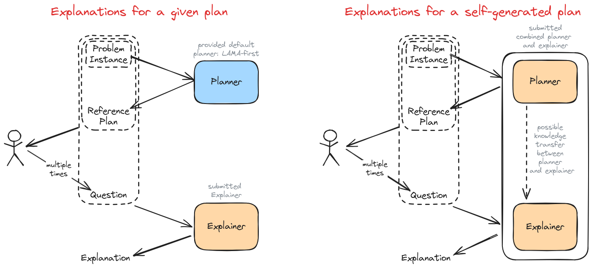

# Explainability Challenge

Another key challenge in addressing the needs of the [Beluga problem](../README.md) is to ensure that the planning techniques used to solve the problem are explainable. 
Participants must demonstrate that their methods can offer clear and insightful explanations of how and why decisions were made.

So far, the plans have been created manually by Airbus planners. 
They take into account the following properties, which can be grouped according to their objective.

Property measuring plan quality:

  1. Minimum number of swaps. A swap is moving a jig between two racks or temporarily storing it in a trailer and placing it on the same rack, to gain access to otherwise blocked jigs.

Properties applied to absorb uncertainties in the flight and production schedule:

  2. Trying to keep at least one rack free.
  3. Placing shorter jigs on shorter racks.

Keeping one rack empty allows to move jigs not considered in the schedule between 
the Beluga hangar and the factory without prior rearrangement. 

Properties to facilitate the manual planning:

  4. Jigs of the same type placed on the same rack.
  5. Empty jigs stored on the Beluga side of the rack system.
  6. Full jigs stored on the factory side of the rack system.

Since these properties are conflicting, there is the need to find a satisfying
trade-off. 

We are addressing two cases:

1. The problem instance is infeasible, and the human planner needs clear, 
  concise and insightful explanations of why the instance is infeasible, as well 
  as insights into how feasibility can be restored.
2. The problem is solvable, and a plan is given. The alternative solutions 
  proposed by the human planner must then be justified by explaining why they 
  are or are not better.

## General Setup

The general setup for both of the two cases is as follows and involves two 
services, a planning and an explanation service. 
First the planning service is called with the problem instance. 
It either provides a *reference plan* or identifies the problem instance as infeasible. 
Then based on this reference plan or the information that the 
problem instance is infeasible, the human planner formulates a question.
Finally, the explanation service is called with the problem instance the reference 
plan/UNSAT and the question. The resulting explanation is then forwarded to the 
human planner.

<a name="explanation_setup"></a>

Participants can either use a provided planning service or submit a combined 
planning and explanation service. 
The provided planning service uses the *LAMA-first* configuration of the 
[Fast Downward](https://github.com/aibasel/downward) planning system.

There are two versions both available on [docker hub](https://hub.docker.com/)

- `tuplestai/planning-service-loc` can be called on a JSON problem instance and 
  returns a plan or `UNSAT`. This is intended for local tests and the generation 
  of training data. Avialable [here](https://hub.docker.com/repository/docker/tuplestai/planning-service-loc/general).
- `tuplestai/planning-service-ws` implements the web service API required in the 
  submission. Will be published soon.

The two options, provided planning service vs combined service, are depicted below.

<a name="explanation_setup"></a>

On the left the explanation approach is able to explain a given plan and does 
not rely on any information acquired during the plan generation.
On the right the planner and explainer are one entity which allows a knowledge
transfer between plan generation and the explainer.


## Explainability Cases

Next we give more details about the two explainability cases. 
Approaches do not need to be able to handle both cases in order to participate.
However, approaches that can handle both cases will have an advantage in the evaluation.
If both cases are addressed, this must be done within the same submission.

### Infeasible Case

A problem instance is infeasible when we cannot achieve the goal from the 
initial state. 
In this case, there are conflicting constraints and/or goals, and potentially 
several ways to resolve these conflicts. 
In this context, computing minimal unsolvable goal subsets (MUGS) is one of the 
existing approaches to extract minimal sets of infeasible subgoals and provide insights in resolving infeasibilities [^1].

The interaction with the planning and explanation services is depicted below.

<a name="explanation_setup"></a>

In this case the task of the planner is to determine infeasibility. 
Note that the planning service does not know which case we are in, and depending 
on the result of the planning service, either a reference plan or USAT, we 
proceed with the appropriate case.

Following the determination of infeasibility the human planners asks
"**Why is the instance infeasible?**".  

The explanations are expected to:

- Provide clear, concise, and insightful explanations for why the problem instance 
  is infeasible.
- Identify key constraints or conflicts leading to infeasibility.
- Suggest potential modifications to make the infeasible instance feasible, where possible.

#### Insights About How The Infeasible Scenarios Can Arise

As an indication, we are providing here a set of methods that have been used to build infeasibility scenarios. This doesn’t mean that all infeasible problems fall in one of those categories and this should be seen as just some hints to explore.

- `RACK_SPACE_GENERAL`:
  Incoming flights carry the maximal number of jigs it is possible to fit in the Beluga, regardless of whether the racks have sufficient space to accommodate them. The outgoing flights are limited to at most one jig. This eventually results in more jigs on site than can fit on the racks and trailers. Depending on the number of flights, this strategy might not lead to an unsolvable instance.

- `OUTGOING_FLIGHT_NOT_SAT`:
  A random outgoing flight requires more jigs of a certain type than the number of jigs of that type that are on site, causing infeasibility.

- `SCHEDULE_CLASHES`:
  This scenario focuses on building instances with schedule clashes. A clash occurs for two loaded jigs `J1` `J2`, if `J2` arrives on a later flight than `J1` but `J2` needs to be delivered to a production line before `J1`. To build those instances, we modify the generator of the production schedule, by filling production schedules greedily to consume jigs in reverse order of their arrival.  This is a more advanced version of the `OUTGOING_FLIGHT_NOT_SAT` scenario. However, it does not guarantee unsolvability.

### Feasible Case

Even if the problem case is feasible and the planning service can provide a 
reference plan, there is still a need for explanation.
The plan may not solve the instance in the way the human planner expects, or it 
may make a different compromise between the properties described in the 
introduction.
For example, the reference plan may keep one rack empty, but uses 10 swaps.
Thus, the human planner indirectly suggested alternative solutions by asking 
questions such as *"How can I reduce the number of swaps?"*.

The explanations are expected to:

- Determine the feasibility of the alternative solution.
- Give an insight into the consequences that the alternative solution would entail.
- Present a comparison of the chosen plan with alternative scenarios that were considered but not selected.
<!-- - Present a comparison of the chosen plan with alternative scenarios (is the case that the explainer is aware of alternative solutions) that were considered but not selected. Only compare alternative solutions that satisfy the properties specified in the problem description.    -->
 
The questions asked by the human planner are limited to:

- Why is jig x loaded on rack A instead of another rack B ?
- Why load jig B on rack D instead of loading jig C on rack A?
- Why not load jig C on rack A before loading jig B on rack D?
- How can I reduce the number of swaps?
- What is the impact of removing rack A for maintenance?
- How can I keep one rack empty all the time?


The setup for the feasible case is given below:

<a name="explanation_setup"></a>

The explanation service must be capable of answering multiple questions about the same 
reference plan. 
The requests for explanations should be considered as separate interactions. 
They are not follow-up questions to previously asked questions.


## Input/Output Specification

In the following the input and output format of the planning and explanation 
service are specified. 
The API of the communication protocol is based on HTTP requests (more details coming soon).


### Input/Output Planning Service

The problem instance is given in a JSON format described [here](../scalability/README.md#json-format) in section *JSON format*.
The explainability challenge only considers deterministic instances.

The upper limit for the problem size is as follows:

| object   | maximal number  |
|----------|:---------------:|
| jig |  25|
| rack |    5   |
| flight | 5 |
| trailer (each side) | 2 |
| hangar | 2 |
|production line | 2|

The plan is expected in the same JSON format as in the deterministic 
scalability challenge.
The format is specified [here](../scalability/README.md#json-format) in section
*Output format*.

In case the instance is unsolvable, the planner is expected to return:

```json
["UNSAT"]
```

### Input/Output Explanation Service

The input for the explanation service is provided in a JSON format with the 
following elements:

- `"instance"` field: problem instance description
- `"plan"` field: reference plan in the JSON format reference above 
  (optional, not present if problem instance is infeasible)
- `"question"` field: question to be answered

The format of the "question" filed is structured as follows:

**`"type"` field**: This field defines the question type and will have one of the following values:

- `"WHY_INFEASIBLE"`
- `"RACK_CHOICE"`
- `"JIG_TO_RACK_ORDER"`
- `"JIG_TO_RACK_ORDER_WHYNOT"`
- `"REDUCE_NUMBER_SWAPS"`
- `"RACK_REMOVAL_IMPACT"`
- `"KEEP_EMPTY"`

These types refer to the question listed in [Section](#feasible-case).

**`"params"` field**: This field is a dictionary, where the format depends on the value of the `"type"` field:

- If `"type"=="WHY_INFEASIBLE"`:
  - No keys
- If `"type"=="RACK_CHOICE"` :
  - Keys are :
    ```jsonc
    ["jig_id", "rack_a", "rack_b"]
    ```
- If `"type"=="JIG_TO_RACK_ORDER"`:
  - Keys are :
    ```jsonc
    ["jig_x_id", "jig_y_id", "rack_c", "rack_d"]
    ```
- If `"type"=="JIG_TO_RACK_ORDER_WHYNOT"`:
  - Keys are :
    ```jsonc
    ["jig_x_id", "jig_y_id", "rack_c", "rack_d"]
    ```
- If `"type"=="REDUCE_NUMBER_SWAPS"`:
  - No keys
- If `"type"=="RACK_REMOVAL_IMPACT"`:
  - Keys are :
    ```jsonc
    "rack_id"
    ```
- If `"type"=="KEEP_EMPTY"`:
  - No keys

**`"question_text"` field**: This field contains the natural language description of the question being asked.

#### Output Format:

Participants are required to provide explanations in **natural language**. 
This will be the format used in the evaluation with the Airbus planners. 
In addition, participants can provide two optional files containing the *"raw"* 
explanation and a visualization. 
These two optional results are taken into account in the scientific evaluation.

1. **Natural Language Explanation File** (mandatory):
   - This file contains the explanation in natural language. The explanations must
      be written in a way that is accessible to a human reader.
   - The file must be named **`NL_explanation.md`**.
   - The use of Markdown enables simple formatting of the output. 
    It is not permitted to insert tables, images or links. Only headings and 
    bulleted lists are permitted.
   - The natural language explanations can be generated using a Large Language Model. 
    See [LLM Support](#llm-support) for details.
   - The submitted explanations will undergo a rigorous assessment by domain experts. These specialists will meticulously review several aspects of the explanations such as their length and interpretability. The primary goal is to ensure that the explanations are clear, comprehensible, and easily followed by both experts and non-experts alike. Participants should be aware that if their explanations are found to be convoluted, unclear, or difficult to understand, they will incur a penalty on their final score.

2. **Raw Explanation File** (optional):

   - This file contains the raw explanation, i.e. the main data used to generate 
    the natural language explanation.
   - Participants should use a suitable structure that best fits their technique 
    and approach. 
   - The file format must be JSON and named **`raw_explanation.json`**.

3. **Visual Explanation File** (optional):

   - This file contains a visualization of the explanations. 
   - This can be a domain dependent or independent visualization. 
   - The file format be PNG and named **`visual_explanation.png`**.

## LLM Support

Participants can optionally use a Large Language Model to generate the natural 
language explanations. 
To ensure a reliable evaluation of the participants' Docker images, we only 
support OpenAI API requests. 

- Dedicated API keys funded by Tuples will be used when testing the submissions. 
- The code used to call the OpenAI API must use environment variable 
  `OPENAI_API_KEY` and must not overwrite the `project` parameter of OpenAI 
  client (we use an environment variable `OPENAI_PROJECT_ID` for this).
- The total cost of usage associated with a submission must not exceed $5. 
  This will be strongly constrained and no additional compute will be provided.
 

## Sample Instances


Participants wll be provided with sample instances and questions on which they can 
train and locally test their explanation techniques. 
Check out the [bechmarks repository](https://github.com/TUPLES-Trustworthy-AI/Beluga-AI-Challenge-Benchmarks)
for more details.

Plans have been generated using the 
[fast-downward](https://github.com/aibasel/downward) planner with the LAMA-first 
configuration. This is a satisficing planner and thus the used reference plans 
can be suboptimal with respect to the number of actions.  It is allowed to use 
a different configuration, planner or approach to generate plans. 

## Submission Guidelines

Participants must provide their submission as a docker image and a file describing their appraoch.

The docker image must follow the [Input/Output specification](##Input/Output-Specification)) and implement the web API which will be published soon.
The submitted code must not connect to external resources, except to OpenAI for the use of LLMs.

The documentation must be submitted as an up to 8-page paper (pdf format) using the [AAAI25 Author Kit](https://aaai.org/authorkit25/) describing explainer and (if applicable) planner service. It must contain:

- names and affiliation of all members
- description of used approach and reference to existing publications if applicable
- any assumptions made or limitations of the approach.

The use of any existing approaches must be referenced accordingly and new or domain dependent approaches must be described in sufficient detail.

The following points of interest, if applicable, must be described as clearly as possible: 
- modification to the model to facilitate explanations
- explanation of raw_explanation format
- explanation of visualization
- reason for limitation of the approach to a subset of questions and/or feasible/infeasible case
- prompts used for the translation to NL with an LLM
- information pre-computed during plan generation that later facilitates the explanations.

## Evaluation Criteria

The evaluation process for this challenge is structured in two distinct phases:

1. Preliminary Submissions
  All submissions leading up to the final one will be assessed on its adherence to the specified format for explanations and whether the planner provides valid plans or returns UNSAT in the case of an unsolvable problem. Preliminary submissions will be tested on a set of test instances to ensure they meet the basic requirements. They will not undergo a comprehensive evaluation of the plan's quality or the depth of the explanations.

2. Final Submission
  Only the final submission will undergo a full evaluation which will be tested on a unique set of hidden test instances. This assessment consists of two parts:  
      - Evaluation by Human Experts: A panel of domain experts will assess the quality and usefulness of the generated plans and the explanations.
      - Scientific Evaluation: This will involve a more technical assessment of the submission's performance and adherence to scientific principles.

Additional Notes:  
      - Participants are encouraged to address all provided questions. However, solutions addressing at least one question will be accepted, with scores limited to the questions answered and their quality.    
      - Each submission will run with 8GB of memory and a timeout of 15 minutes. This timeout includes both the planning and explanation processes. If planning takes longer, the explanation must be provided faster. This constraint applies to both participant submissions and the provided default planner.  

### Human Evaluation

Explanations will be assessed by a group of domain experts, who specialise in 
Beluga logistics, but they are not AI experts. 
They will provide a subjective evaluation of the quality and usefulness of 
explanations.

To focus on the explanation quality, all explanations will be precomputed. 
If a submission is not able to answer a question at all or within the specified 
time limit, the sample will be awarded a score of 0.
Participants are encouraged to answer all provided questions. However, solutions addressing at least one question will be accepted, though with a score limited to the questions answered and its corresponding quality. Please provide clear and comprehensible explanations, as convoluted or unclear responses will incur penalties on the final score. 

The domain experts will be given the problem instance, a reference 
plan (if applicable), the pre-selected question and the explanation
generated by the submission. 
The planning instance will be shown as a visualization of the initial state 
and the plan as an animation of the individual actions.

### Scientific Evaluation

Submissions will be benchmarked for computational performance on standardized hardware. A panel of experts will review the scientific methods and technical approaches.


[^1]: Eifler, R., Cashmore, M., Hoffmann, J., Magazzeni, D., & Steinmetz, M. (2020). A New Approach to Plan-Space Explanation: Analyzing Plan-Property Dependencies in Oversubscription Planning. In Proceedings of the Thirty-Fourth AAAI Conference on Artificial Intelligence (AAAI-20). AAAI Press.
