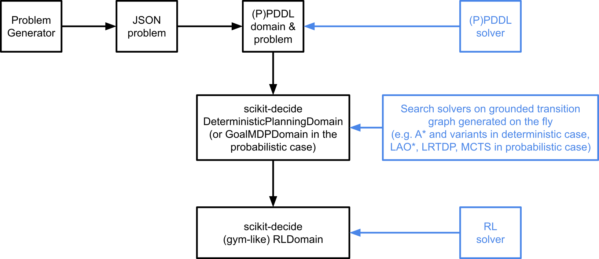

# Scalability Challenges

## Introduction

A huge difficulty in meeting the needs described in the [Use Case description](../README.md#use-case-description), is to have solutions that are scalable to the problem whilst being realistic or feasible. 

We consider two tracks:

- a **deterministic** track and
- a **probabilistic** track with uncertainties in the flight schedule.


## Problem Versions

### Deterministic Version

In the deterministic version of the problem, we do not consider any uncertain event. 
The problem consists in finding a plan, i.e. a sequence of actions, which reaches 
a goal consisting in the 3 following conditions to be met:

- all parts coming in the Beluga flights are unloaded in the required order and stored in the rack system
- all parts to be consumed by the production lines are sent to production in the required order
- all empty jig types to be carried by outgoing Beluga flights are sent to the Beluga in a required order. 
  Note that only jig types, i.e. classes of jigs with same empty size and same loaded size, are required to be returned to outgoing flights, but not specific jig instances.

Due to the limited number of racks and to the fixed length of the racks, a 
random plan has little chance to reach the goal when the rack system becomes 
saturated. 

### Probabilistic Version
In the probabilistic version, we consider uncertainties in the flight arrival 
times, which can alter the sequence in which jigs become available. 

#### Realistic Model
Variability among arrival times is simulated via a two-step process:
When generating a new problem instance, each flight is assigned a scheduled 
arrival time; the order of the flights in the instance description reflects 
the scheduled arrivals.
When simulating execution, an amount of delay is assigned to each flight, 
thus perturbing the order of arrivals
In detail, flights are first assigned an arrival hour according to a Poisson 
distribution with time-dependent rate, then individual scheduled arrival times 
are sampled uniformly at random from the assigned hourly interval. 
The delays are generated according to a discretized continuous distribution. 
Both distributions have been calibrated on real world data and adapted for the 
use of the competition.

#### Abstract Model
As a trade-off between practical relevance and computation complexity, we also 
allow for the use of an abstracted uncertainty model. 
This consists of a discrete transition table, where each transition associates 
the last observed beluga to the flights that might follow it. 
A transition table may then look as follows:

| | | |
|--------------|-----------------|-------------|
| Last Beluga | Next Beluga     | Probability |
| B1 | B3 | … |
| B1 | B2 | … |


Probabilities are estimated by Monte Carlo simulation over the previously 
described, more realistic, model.
The transition model is not a Markov Chain, since it does not guarantee that 
all flights eventually arrive, nor that each flight arrives exactly once. 
Instead, this abstract model is designed for use in PPDDL approaches, which 
can guarantee both properties by properly modelling action effects and preconditions.


The problem consists in finding a policy, i.e. a mapping from states to actions, 
whose execution optimises the evaluation metrics. 
Policies might rely on either the realistic or the abstract uncertainty model, 
but they will always be evaluated based on the realistic uncertainty model.


## Input Formats

We provide 3 input formats which are suited to model-based approaches (e.g. planning and scheduling) and to simulation-based approaches (e.g. reinforcement learning):

- A `JSON` description of the problem's topology and initial state, but not containing the description of the action's logics. The participants who use this format must implement on their side the logics of the actions which is formalised in the [PDDL description](#pddl-format) below. For the probabilistic track, transition information (state, next arrival, and probability) for the transitions in the Markov chain model are available in supplementary dedicated fields of the JSON description.
- A `(P)PDDL` description of the problem's topology, initial state and actions' logics. The participants can of course extend or change the (P)PDDL description according to their needs provided it describes the same problem.
- `scikit-decide` domains implemented in Python, including a gym-like environment domain, which provide the list of applicable actions in a given state, the state transition generator (as a discrete probability distribution in the probabilistic case), and a simulator of the state transition function (which samples a random next state in the probabilistic case).

The following picture summarises the provided models which can be handled by different approaches including (P)PDDL, search algorithms, reinforcement learning.

<a name="model-availability-diagramme"></a>

We first define the states and actions of the problem.

### States

The set of states is defined as a cross product of the following sets:

- Singleton indicating the current Beluga flight: `current_beluga=<beluga>`
- Ordered list indicating a fixed number of the most recent flights: `last_belugas=[<list of beluga>]`
- Ordered list of jigs that are currently inside the current Beluga, seen from racks' side: `beluga_contents=[<list of jigs>]`
- For each production line `pl`, ordered list of jigs that have been delivered to production line `pl`: `production_line_deliveries(pl)=[<list of jigs>]`
- For each rack `r`, ordered list of jigs that are currently stored in rack `r`, seen from Beluga's side: `rack_contents(r)=[<list of jigs>]`
- For each trailer `t`, singleton containing the jig currently on trailer `t` (can be `"null"` if no jig is currently carried on trailer `t`): `trailer_load(t)=<jig | "null">`
- For each jig `j`, singleton containing a Boolean indicating whether jig `j` currently loads a part or not: `jig_empty(j)=<Boolean>`
- For each trailer `t`, pair containing the location of trailer `t` (either `"beluga"` or a `rack` or a `hangar`) and the parked side (`"null"` in case of `"beluga"` or hangars): `trailer_location(t)=(<"beluga" | rack | hangar>, <side | "null">)`
- For each hangar `h`, singleton containing the jig currently parked inside it (can be `"null"` if no trailer is currently parked in hangar `h`): `hangar_host(h)=<jig | "null">`

### Actions

The list of actions is the following:

- for each jig `j`, Beluga flight `b` and trailer `t`, `load_beluga(j, b, t) :` unload jig `j` from trailer `t` and load it onto Beluga flight `b`
- for each jig `j`, Beluga flight `b` and trailer `t`, `unload_beluga(j, b, t) :` unload jig `j` from Beluga flight `b` and load it onto trailer `t`
- for each jig `j`, hanger `h` and trailer `t`, `get_from_hanger(j, h, t) :` load jig `j` currently located in hangar `h` onto trailer `t`
- for each jig `j`, hanger `h`, trailer `t` and production line `pl`, `deliver_to_hanger(j, h, t, pl) :` deliver jig `j` currently loaded onto trailer `t` to production line `pl` by using hangar `h`
- for each jig `j`, trailer `t`, rack `r` and side `s`, `put_down_rack(j, t, r, s) :` put down jig `j` currently loaded onto trailer `t` at side `s'` edge of rack `r` (`j` will be next at the edge of `r`)
- for each jig `j`, trailer `t`, rack `r` and side `s`, `pick_up_rack(j, t, r, s) :` pick up jig `j` from side `s'` edge of rack `r` and load it onto trailer `t` (`j` must be at the edge of `r`)
- for each Beluga flight `b`, `switch_to_next_beluga():` next unloading/loading operations will now concern the successive Beluga flight (which assumes that the previous Beluga flight's operations are complete)

## JSON Format

The problem is defined in JSON format which describes the topology of the problem (i.e. number of jigs, racks, trailers, hangars), but also the initial state of the problem (i.e. whether jigs hold parts or not, where the jigs are initially stored). At the top level, it contains the following entries:

- `trailers_beluga:` list of trailers which are available on the Beluga side (used to transit jigs between the Beluga and the racks) as a list of dictionaries in the form:
  ```jsonc
  { "name": <string> }
  ```
- `trailers_factory:` list of trailers which are available on the factory side (used to transit jigs between the racks and the hangars) as a list of dictionaries in the form:
  ```jsonc
  { "name": <string> }
  ```
- `hangars:` list of hangar (string) names
- `jig_types:` jig types defining classes of jigs with same empty size (i.e. when not holding part), and same loaded size (i.e. when holding part), defined as a dictionary of jig type name to dictionaries in the form:
  ```jsonc
  { "name": <string>, "size_empty": <integer>, "size_loaded": <integer> }
  ```
- `racks`: list of racks defined as a list of dictionaries in the form:
  ```jsonc
  {
    "name": <string>,
    "size": <integer>,
    "jigs": <ordered list of strings>
  }
  ```
- `jigs:` list of jig instances defined as a list of dictionaries in the form (`"empty"==true` means that the jig does not hold a part in the initial state):
  ```jsonc
  { "name": <string>, "type": <string>, "empty": <Boolean> }
  ```
- `production_lines:` list of production lines defining the ordered sequence (i.e. schedule) of jigs consumed by each production line, defined as a list of dictionaries in the form:
  ```jsonc
  { "name": <string>, "schedule": <ordered list of strings> }
  ```
- `flights:` list of flights defining the ordered sequence of Beluga flights occupying the loading/unloading area, defined as a list of dictionaries in the form (the "incoming" – resp. "outgoing" – field lists the sequence of loaded – resp. empty type – jigs to unload from – resp. to load into – the Beluga):
  ```jsonc
  {
    "name": <string>,
    "incoming": <ordered list of strings>,
    "outgoing": <ordered list of strings>,
    "scheduled_arrival": <float>
  }
  ```

The instances designed to be used with the [probabilistic models](#problem-versions) (both the realistic and the abstract one) have an additional field for each flight, i.e. `scheduled_arrival` field, representing the scheduled arrival time.

In addition, instances that can be used with the _abstract_ uncertainty model also come with three additional fields representing the Markov chain's transition table: `tt_last`, `tt_next`, and `tt_prob`. All three are lists with equal length, whose `i`-th entries represent the `i`-th transition of the Markov chain:

- `tt_last:` gives the source state, i.e., the last observed beluga; sequences of length 0 are represented using `null` to fill up the blank
- `tt_next:` gives the next beluga given the history of past flight
- `tt_prob:` gives the probability associated with the `i`-th transition

The goal is implicit and consists in:

- sending all the incoming jigs to the production lines while respecting the ordering defined in the `"incoming"` field of the `"flights"` dictionaries and the ordering defined in the `"schedule"` field of the `"production_lines"` dictionaries, with the obvious constraint that a jig can be sent to the production line only after it arrives in an incoming Beluga flight ;
- sending all the outgoing jigs to the Beluga while respecting the ordering defined in the `"outgoing"` field of the `"flights"` dictionaries.

## PDDL Models

We provide two PDDL versions of the Beluga domain: classical and numeric. The rack space usage is easier to model with numeric fluents (aka PDDL functions), but the range of possible lengths is sufficiently reasonable to be represented as a set of symbols which can be used in a classical PDDL model.

### Classical PDDL Model

The model defines the following types:

- `location:` subtype of `object`
- `beluga:` subtype of `location;` represents a Beluga flight
- `hangar:` subtype of `location;` represents a craning hangar
- `jig:` subtype of `location;` represents a jig instance
- `rack:` subtype of `location;` represents a rack instance
- `trailer:` subtype of `location`; represents a trailer holding and moving jigs around
- `type:` subtype of `object;` represents a jig type
- `num:` subtype of `object;` represents a number as a symbol, typically a length
- `production-line:` subtype of `object`
- `side:` subtype of `object;` represents the Beluga or factory side of racks
- `slot:` subtype of `object;` represents a counter of number of empty jig instances of a given jig type that must be returned to the outgoing Beluga flights

The model makes use of static predicates which represent the problem topology, and dynamic predicates which encode the evolving state of the problem.

- Static predicates
  - `(fit ?nspace - num ?jsize - num ?fspace - num ?r - rack):` it means that `?nspace = ?jsize + ?fspace`
  - `(is_type ?j - jig ?jt - type):` jig `?j` is of type `?jt`
  - `(next-flight-to-process ?b - beluga ?nb - beluga):` flight `?nb` follows flight `?b`
  - `(next_deliver ?j - jig ?jn - jig):` jig `?jn` must be delivered to the factory just after jig `?j`
  - `(next_load ?jt - type ?s - slot ?ns - slot ?b - beluga):` slot `?ns` follows slot `?s` to be filled by an empty jig of type `?jt` in outgoing Beluga flight `?b`
  - `(next_unload ?j - jig ?nj - jig):` jig `?nj` is next to be unloaded just after jig `?j`
  - `(at-side ?l - location ?s - side):` location `l?` is accessible from side `?s`, used for trailers and rack access
- Dynamic predicates
  - `(clear ?j - jig ?s - side):` there is no jig next to `?j` looking from side `?s`
  - `(empty ?l - location):` there is no jig in the trailer/hangar `?l`
  - `(empty-size ?j - jig ?es - num):` size `?s` of jig `?j` after unloading the held part in the hangar
  - `(free-space ?r - rack ?n - num)`
  - `(processed-flight ?b - beluga):` indicates we are processing flight `?b` (flights are strictly ordered by `flight-to-process`)
  - `(in ?j - jig ?l - location):` jig `?j` is at location `?l`
  - `(on ?j - jig ?nj - jig ?s - side):` jig `?nj` is next to jig `?j` in the rack they are in (as traced by `in`), seen from side `?s`
  - `(size ?j - jig ?s - num):` jig `?j` currently has size `?num` (depending on whether it is empty or loaded)
  - `(to_deliver ?j - jig ?pl - production-line):` jig `?j` must be delivered to production line `?pl` (the successor/next jig to deliver is defined by `next_deliver`)
  - `(to_load ?jt - type ?s - slot ?b - beluga):` jig type `?jt` must be loaded onto slot `?s` of Beluga flight `?b` (the successor/next jig type to deliver is defined by `next_load`)
  - `(to_unload ?j - jig ?b - beluga):` jig `?j` must be unloaded from Beluga `?b` (the successor/next jig to deliver is defined by `next_unload`)

Now we define the PDDL actions. Note that some action parameters represent next jigs and next slots which are parts of the effects imposed by the problem topology, and whose purpose is to avoid using universally quantified and conditional effects. Since such artifacts are specific to the PDDL modelling, we indicate the correspondence between the following PDDL actions and the action symbols defined at the beginning of this section.

- `(load-beluga ?j - jig ?jt - type ?njt - type ?b - beluga ?t - trailer ?s - slot ?ns - slot):` load jig `?j` of type `?jt`, which is currently on trailer `?t`, onto slot `?s` of Beluga flight `?b`; the next jig type to load must match with `?njt` and the next jig slot to fill must match with `?ns` ⇒ corresponds to `load_beluga(?j, ?b, ?jt)`
- `(unload-beluga ?j - jig ?nj - jig ?t - trailer ?b - beluga):` unload jig `?j` from Beluga flight `?b` and put it on trailer `?t;` the next jig to unload must match with `?nj` ⇒ corresponds to `unload_beluga(?j, ?b, ?t)`
- `(get-from-hangar ?j - jig ?h - hangar ?t - trailer):` get jig `?j` from craning hangar `?h` by using trailer `?t` ⇒ corresponds to `get_from_hangar(?j, ?h, ?t)`
- `(deliver-to-hangar ?j - jig ?jn - jig ?t - trailer ?h - hangar ?pl - production-line ?s - num ?es - num):` deliver jig `?j` carried on trailer `?t` to production line `?pl` via hangar `?h`; the next jig to send to production must match with `?jn`; the loaded size of jig `?j` must match with `?s` and its empty size with `?es` ⇒ corresponds to `deliver_to_hangar(?j, ?h, ?t, ?pl)`
- `(put-down-rack ?j - jig ?t - trailer ?r - rack ?s - side ?jsize - num ?fspace - num ?nspace - num):` put down jig `?j` of current size `?jsize` and carried on trailer `?t` on side `?s'` edge of empty rack `?r` whose free space is `?fspace;` the new available space of rack `?r` must match with `?nspace` ⇒ corresponds to `put_down_rack(?j, ?t, ?r, ?s)`
- `(stack-rack ?j - jig ?nj - jig ?t - trailer ?r - rack ?s - side ?os - side ?jsize - num ?fspace - num ?nspace - num):` put down jig `?j` of current size `?jsize` and carried on trailer `?t` on side `?s'` edge of rack `?r` whose free space is `?fspace` and which already contains jig `?nj` on the same edge; the other side of rack `?r` must match with `?os` and its new available space with `?nspace` ⇒ corresponds to `put_down_rack(?j, ?t, ?r, ?s)`
- `(pick-up-rack ?j - jig ?t - trailer ?r - rack ?s - side ?os - side ?jsize - num ?fspace - num ?nspace - num):` pick up jig `?j` of current size `?jsize` from side `?s'` edge of rack `?r` whose free space is `?fspace` and that only contains jig `?j`, and put it on trailer `?t`; the other side of rack `?r` must match with `?os` and its new available space with `?nspace` ⇒ corresponds to `pick_up_rack(?j, ?t, ?r, ?s)`
- `(unstack-rack ?j - jig ?nj - jig ?t - trailer ?r - rack ?s - side ?os - side ?jsize - num ?fspace - num ?nspace - num):` pick up jig `?j` of current size `?jsize` from side `?s'` edge of rack `?r` whose free space is `?fspace` and whose next jig on the same side is `?nj`, and put it on trailer `?t`; the other side of rack `?r` must match with `?os` and its new available space with `?nspace` ⇒ corresponds to `pick_up_rack(?j, ?t, ?r, ?s)`
- `(beluga-complete ?b - beluga ?nb - beluga):` switch from Beluga flight `?b` to Beluga flight `?nb` after having unloaded all the required jigs from `?b` and loaded all the required empty jigs to `?b` ⇒ corresponds to `switch_to_beluga(?nb)`

One can note that actions put-down-rack and stack-rack are mostly the same except that the former operate on an empty rack and the latter on a rack already containing jigs. This distinction is required by our PDDL model of the domain which makes use of different predicates in those 2 cases (for instance, the latter reasons about `(on ?j - jig ?nj - jig ?s - side)` which is meaningful only when the rack is not empty). The same logics apply to actions `pick-up-rack` and `unstack-rack`.

### Numeric PDDL Model

The numeric PDDL model is mostly the same as the classical model, except that the object symbols representing numeric quantities such as lengths are replaced with PDDL functions.  
The model defines the following types:

- `location:` subtype of `object`
- `beluga:` subtype of `location;` represents a Beluga flight
- `hangar:` subtype of `location;` represents a craning hangar
- `jig:` subtype of `location;` represents a jig instance
- `rack:` subtype of `location;` represents a rack instance
- `trailer:` subtype of `location;` represents a trailer holding and moving jigs around
- `type:` subtype of `object;` represents a jig type
- `production-line:` subtype of `object`
- `side:` subtype of `object;` represents the Beluga or factory side of racks
- `slot:` subtype of `object;` represents a counter of number of empty jig instances of a given jig type that must be returned back to the outgoing Beluga flights

The model makes use of static predicates which represent the problem topology, and dynamic predicates which encode the evolving state of the problem.

- Static predicates
  - `(is_type ?j - jig ?jt - type):` jig `?j` is of type `?jt`
  - `(next-flight-to-process ?b - beluga ?nb - beluga):` flight `?nb` follows flight `?b`
  - `(next_deliver ?j - jig ?jn - jig):` jig `?jn` must be delivered to the factory just after jig `?j`
  - `(next_load ?jt - type ?s - slot ?ns - slot ?b - beluga):` slot `?ns` follows slot `?s` to be filled by an empty jig of type `?jt` in outgoing Beluga flight `?b`
  - `(next_unload ?j - jig ?nj - jig):` jig `?nj` is next to be unloaded just after jig `?j`
  - `(at-side ?l - location ?s - side):` location `l?` is accessible from side `?s`, used for trailers and rack access
- Dynamic predicates
  - `(clear ?j - jig ?s - side):` there is no jig next to `?j` looking from side `?s`
  - `(empty ?l - location):` there is no jig in the trailer/hangar `?l`
  - `(processed-flight ?b - beluga):` indicates we are processing flight `?b` (flights are strictly ordered by `next-flight-to-process`)
  - `(in ?j - jig ?l - location):` jig `?j` is at location `?l`
  - `(next-to ?j - jig ?nj - jig ?s - side):` jig `?nj` is next to jig `?j` in the rack they are in (as traced by `in`), seen from side `?s`
  - `(to_deliver ?j - jig ?pl - production-line):` jig `?j` must be delivered to production line `?pl` (the successor/next jig to deliver is defined by `next_deliver`)
  - `(to_load ?jt - type ?s - slot ?b - beluga):` jig type `?jt` must be loaded onto slot `?s` of Beluga flight `?b` (the successor/next jig type to deliver is defined by `next_load`)
  - `(to_unload ?j - jig ?b - beluga):` jig `?j` must be unloaded from Beluga `?b` (the successor/next jig to deliver is defined by `next_unload`)
- Static functions
  - `(empty-size ?j - jig):` size of jig `?j` after unloading the held part in the hangar
- Dynamic functions
  - `(free-space ?r - rack):` free space in rack `?r`
  - `(size ?j - jig):` size of jig `?j`, whose value depends on whether it is empty (i.e. not holding a part) or loaded (i.e. holding a part)
  - `(total-cost):` cumulated cost since the beginning of the plan execution

Now we define the PDDL actions. Note that some action parameters represent next jigs and next slots which are parts of the effects imposed by the problem topology, and whose purpose is to avoid using universally quantified and conditional effects. Since such artefacts are specific to the PDDL modelling, we indicate the correspondence between the following PDDL actions and the action symbols defined at the beginning of this section.

- `(load-beluga ?j - jig ?jt - type ?njt - type ?b - beluga ?t - trailer ?s - slot ?ns - slot):` load jig `?j` of type `?jt`, which is currently on trailer `?t`, onto slot `?s` of Beluga flight `?b`; the next jig type to load must match with `?njt` and the next jig slot to fill must match with `?ns` ⇒ corresponds to `load_beluga(?j, ?b, ?jt)`
- `(unload-beluga ?j - jig ?nj - jig ?t - trailer ?b - beluga):` unload jig `?j` from Beluga flight `?b` and put it on trailer `?t`; the next jig to unload must match with `?nj` ⇒ corresponds to `unload_beluga(?j, ?b, ?t)`
- `(get-from-hangar ?j - jig ?h - hangar ?t - trailer):` get jig `?j` from craning hangar `?h` by using trailer `?t` ⇒ corresponds to `get_from_hangar(?j, ?h, ?t)`
- `(deliver-to-hangar ?j - jig ?jn - jig ?t - trailer ?h - hangar ?pl - production-line ?s - num ?es - num):` deliver jig `?j` carried on trailer `?t` to production line `?pl` via hangar `?h`; the next jig to send to production must match with `?jn`; the loaded size of jig `?j` must match with `?s` and its empty size with `?es` ⇒ corresponds to `deliver_to_hangar(?j, ?h, ?t, ?pl)`
- `(put-down-rack ?j - jig ?t - trailer ?r - rack ?s - side):` put down jig `?j` carried on trailer `?t` on side `?s'` edge of empty rack `?r` ⇒ corresponds to `put_down_rack(?j, ?t, ?r, ?s)`
- `(stack-rack ?j - jig ?nj - jig ?t - trailer ?r - rack ?s - side ?os - side):` put down jig `?j` carried on trailer `?t` on side `?s'` edge of rack `?r` which already contains jig `?nj` on the same edge; the other side of rack `?r` must match with `?os` ⇒ corresponds to `put_down_rack(?j, ?t, ?r, ?s)`
- `(pick-up-rack ?j - jig ?t - trailer ?r - rack ?s - side ?os - side):` pick up jig `?j` from side `?s'` edge of rack `?r` which only contains jig `?j`, and put it on trailer `?t`; the other side of rack `?r` must match with `?os` ⇒ corresponds to `pick_up_rack(?j, ?t, ?r, ?s)`
- `(unstack-rack ?j - jig ?nj - jig ?t - trailer ?r - rack ?s - side ?os - side):` pick up jig `?j` from side `?s'` edge of rack `?r` whose next jig on the same side is `?nj`, and put it on trailer `?t`; the other side of rack `?r` must match with `?os` ⇒ corresponds to `pick_up_rack(?j, ?t, ?r, ?s)`
- `(beluga-complete ?b - beluga ?nb - beluga):` switch from Beluga flight `?b` to Beluga flight `?nb` after having unloaded all the required jigs from `?b` and loaded all the required empty jigs to `?b` ⇒ corresponds to `switch_to_beluga(?nb)`

### Probabilistic PDDL Model

The probabilistic PDDL model differs from the deterministic version primarily in the `beluga-complete` action. 
Rather than following a predefined flight arrival order deterministically, in the probabilistic version the next flight is chosen with a probability as determined by the Markov chain, depending on the history of past flights. The history is tracked via a new dynamic predicate, whose arity depends on the parameter `K` used for the probability distribution generation:

- `(flight-history ?bK ?bK_1 … ?b1 - beluga):` the currently processed flight is `?b1`, the one before that `?b2`, and so on.

Due to the dependency of the next flight’s probability on the history, the probabilistic version of the `beluga-complete` actions are pre-grounded. There is one

- `beluga-complete-bK-bK_1-...-b1` action for each transition in the Markov chain, which requires that the current flight history is `bK bK_1 … b1`, and similarly to the deterministic PDDL version requires that the current flight, `b1`, has been completed. It will change the currently processed flight according to the transition probabilities in the Markov chain, updating the `flight-history` tracking fact accordingly.

The probabilistic version can be used either with the [classical](#classical-pddl-model) or [numeric](#numeric-pddl-model) encoding. 

### Scikit-decide Domains (including a gym-like environment)

Finally, for PDDL-agnostic search algorithms or simulation-based approaches like reinforcement learning, we provide scikit-decide domains – one for the deterministic challenge, another one for the probabilistic challenge – which wrap a PDDL simulator into a scikit-decide domain via plado. The latter eventually provides methods for interacting with the domain in a gym-like fashion, while also providing methods to access the full state transition function (and not just samples of successor states).

For the deterministic challenge, the domain derives from a Python [scikit-decide DeterministicPlanningDomain class](https://airbus.github.io/scikit-decide/reference/_skdecide.domains.html#deterministicplanningdomain) which notably provides the following methods:

- `is_terminal(state):` returns a Boolean indicating whether `state` is terminal or not (the only terminal states are goal states in our Beluga problem)
- `get_next_state(state, action):` returns the state obtained when executing `action` in `state`
- `get_transition_value(state, action):` returns the cost of executing `action` in `state`
- `get_applicable_actions_from(state):` returns the list of applicable actions in `state`
- `get_goals():` returns an implicit space defined as a lambda function which takes a state as input and that returns a Boolean indicating whether this state is a goal or not
- `get_initial_state():` returns the initial state of the problem

States and actions are Python dictionaries following the JSON encoding of states and actions defined in the next section.

You may have noticed that the aforementioned methods do not match the ones of a typical Gym domain. However, the DeterministicPlanningDomain class actually derives from domain feature classes, namely [Environment class](https://airbus.github.io/scikit-decide/reference/_skdecide.builders.domain.dynamics.html#environment) and [Initializable class](https://airbus.github.io/scikit-decide/reference/_skdecide.builders.domain.initialization.html#initializable) and [Actions_class](https://airbus.github.io/scikit-decide/reference/_skdecide.builders.domain.events.html#actions) and [FullyObservable class](https://airbus.github.io/scikit-decide/reference/_skdecide.builders.domain.observability.html#fullyobservable), which altogether provide the following methods, to be used by reinforcement learning algorithms:

- `step(action):` returns an `EnvironmentOutcome(observation, value, terminal, info)`
- `reset():` returns an observation (a state in our fully observable case)
- `get_observation_space():` returns a list space defining to the cross-product of state space variables
- `get_action_space():` returns a dictionary space defining the action as a dictionary (see below)

As can be seen, the competitors can play with this scikit-decide domain either at the planning level which is well suited to (grounded) search algorithms like A\*, or at the environment/simulation level which is well suited to reinforcement learning algorithms.

For the probabilistic challenge, we provide a [scikit-decide GoalMDPDomain class](https://airbus.github.io/scikit-decide/reference/_skdecide.domains.html#goalmdpdomain) which embeds and simulates a realistically probabilistically noised version of the PDDL problem, or an abstracted PPDDL version of the latter. It basically provides the same methods as the deterministic domain class described above, except that get_next_state(state, action) is replaced with:

- `get_next_state_distribution(state, action):` returns a `DiscreteDistribution(list_of_state_and_probability_pairs)`

This class can be used by probabilistic search algorithms like LRTDP, MCTS, LAO\*, etc. It also eventually derives from the same domain feature classes previously mentioned for the deterministic case, thus providing the typical methods queried by reinforcement learning algorithms.

More details are provided in the competition [tools repository](https://github.com/TUPLES-Trustworthy-AI/beluga-challenge-tools) on the actual available [scikit-decide domains](https://github.com/TUPLES-Trustworthy-AI/beluga-challenge-tools#scikit-decide-domain-tester) and [gym-like environments](https://github.com/TUPLES-Trustworthy-AI/beluga-challenge-tools#gymnasium-environment-tester).

Each submission will eventually need to be wrapped in a web service and communicate with the evaluation system by means of JSON messages.
We provide a default Python API as part of the competition toolkit, in the "tools/evaluation/planner_api.py" module, together with naïve implementation examples in "tools/evaluation/planner_examples.py". If the competitors build their solutions by relying on the provided base classes, it will be possible to use a default wrapper to obtain the required web services. Web service templates and the default wrapper will be made available to facilitate this task as part of the competition toolkit hosted on [GitHub](https://github.com/TUPLES-Trustworthy-AI/Beluga-AI-Challenge).

## Output Format

### Deterministic Track

For the deterministic track, the planners should produce a sequence of actions (aka _plan_) containing only action symbols picked from the set of allowed action symbols formatted in JSON.

Python code to help with generating and parsing plans in the correct format is available in the toolkit, in particular in `evaluation/planner_api.py` through the `BelugaAction` subclasses and the `BelugaPlan` class.

The available actions, with their expected format are as follows:

```jsonc
{"name": "load_beluga", "j": <jig name>, "b": <beluga flight name>, "t": <trailer name>}
{"name": "unload_beluga", "j": <jig name>, "b": <beluga flight name>, "t": <trailer name>}
{"name": "get_from_hangar", "j": <jig name>, "h": <hangar name>, "t": <trailer name>}
{"name": "deliver_to_hangar", "j": <jig name>, "h": <hangar name>, "t": <trailer name>, "pl": <production line name>}
{"name": "put_down_rack", "j": <jig name>, "t": <trailer name>, "r": <rakc name>, "s": <side name, i.e. either "bside" or "fside">}
{"name": "pick_up_rack", "j": <jig name>, "t": <trailer name>, "r": <rakc name>, "s": <side name, i.e. either "bside" or "fside">}
{"name": "switch_to_next_beluga"}
```

The solution plan is a JSON list of actions in the form `<ordered list of actions>`, so for instance:

```jsonc
[{"name": load_beluga, "j": "j_0", "b": "b_0", "t": "t_0"},
 {"name": switch_to_next_beluga}, …]
```

### Probabilistic Track

For the probabilistic track, the planners should produce a mapping from states to actions (aka _policy_) which will be queried by the competition evaluator through a state→action web service. Each individual action is formatted in JSON as for the deterministic challenge. The states are also formatted in JSON, with representation based on [the state variable symbols defined previously](#states).

Python code to help with state management (including serialization and deserialization) is available in the toolkit, in the module `beluga_lib/problem_state.py`, through the `BelugaProblemState` class.

In detail, the problem state format is as follows:

```jsonc
{
  "current_beluga": <beluga flight name>,
  "last_belugas": <list of the names of all arrived beluga flights, including the current one>,
  "beluga_contents": <list of the names of the jigs in the current beluga>,
  "production_line_deliveries": {
    <production line name>: <list of the names of jigs already delivered to that production line>
  },
  "rack_contents": {
    <rack name>: <list of the names of jigs on the rack>
  },
  "trailer_load": {
    <trailer name>: <name of the jig currently on the trailer, or null if the trailer is empty>
  },
  "jig_empty": {
    <jig name>: <true if the jig is empy, false otherwise>
  },
  "trailer_location": {
    <trailer name>: (<either "beluga", or a hangar name, or a rack name>, <ether "bside" or "fside" in case of rack name, otherwise null>)
  },
  "hangar_host": <jig name, or null if the hangar is empty>
}
```

## Problem Generator

We provide a problem generator that the competitors can play with to generate random problems of different topologies and sizes. The evaluation problems, which we do not disclose yet, will be sampled from this simulator. The competitors are, however, free to generate their own testing problems and to look at the code of the generator which in the  [toolkit](https://github.com/TUPLES-Trustworthy-AI/beluga-challenge-tools/blob/main/README.md#problem-generator) TODO. As shown in the [diagram](#model-availability-diagramme), all the available models eventually originate from problems encoded in JSON, which can themselves be translated into (P)PDDL problems, using the scripts 
provided by the [toolkit](https://github.com/TUPLES-Trustworthy-AI/beluga-challenge-tools/blob/main/README.md#pddl-encoding) TODO.


## Submission Package

All participants must submit a package consisting of the following items:

- A docker file containing the code of their planner. This docker file must
  implement a web service interacting to interact with our evaluation server. 
  The specification of the web service protocol will be released soon.

- An up to 8-page paper using the [AAAI25 Author Kit](https://aaai.org/authorkit25/)
  describing their planner.
  The documentation should include:
  - references to existing approaches that have been used or extended
  - New or domain dependent approaches must be described in sufficient detail 
    by providing a description of the planner architecture and logics, e.g. 
    pseudo-code of the different methods composing the planner.
  - Reinforcement learning approaches should describe the architecture of the 
    neural nets and provide training times and setup configurations.

Instructions for the submission procedure can be found here: [TODO]().

## Evaluation

There will be two evaluation stages.

Submissions will be continuously evaluated during the course of the competition,
providing immediate feedback to the participants. Results will be made public
via a leader board. More details will follow.

The winner of the competition will be determined in a final evaluation stage, past the
submission deadline. 

The continuous and the final evaluation stages will be based on disjoint Beluga
instance collections. Both collections are generated following the parameter
space described in [tool README](TODO). The final standing, in particular
the winner, will hence not necessarily reflect the stand of the continuous
evaluation leader board.

Submissions that return an invalid action or an inapplicable action will be 
considered invalid and disqualified.

The evaluation will be run on a single CPU core.
We use a memory limit of 8 GB and a time limit of 15 minutes per instance.

### Deterministic Track

The time limit covers the computation of one plan for a given instance.

The metrics we consider are:

  - $S$: instance solved ($S=1$) and unsolved ($S=0$)
  - $L$: plan length 
  - $F$: number of free racks at the end of the plan

  The score per instance $i$ is defined as:

  $score(i) = S * e^{-\alpha \frac{L}{jigs(i)}} * e^{-\beta \frac{racks(i)}{F+1}}$
 
  where $jigs(i)$ corresponds to the total number of jigs in instance $i$ 
  and $racks(i)$ to the number of racks. $\alpha$ and $\beta$ will be fixed 
  as means to balance the scale of scores between $L$ and $F$ and across all 
  benchmark instances.

  The overall score of benchmark set $B$ is computed as the sum of the 
  scores of the individual instances in $B$.


### Probabilistic Track

Instances are evaluated using Monte-Carlo simulations for estimating the expected
score of the computed policy. The participants need to finish policy computation
and $N$ (to be determined) simulations runs within the provided time limit. Time
can be allocated freely by the participants, e.g., spending the largest fraction
on policy optimization prior to the simulation runs, or optimizing the policy
online during the simulations.

Each simulation run will be evaluated using the very same metrics as in the
deterministic track. The final score for instance $i$ over Monte-Carlo samples
$MCS(i)$ is computed by

$score(i) = \frac{1}{N} * \sum_{s \in MCS(i)} score(s)$

Note that simulation runs not finished within the time limit are considered
*unsolved* and assigned a score of $0$. 
